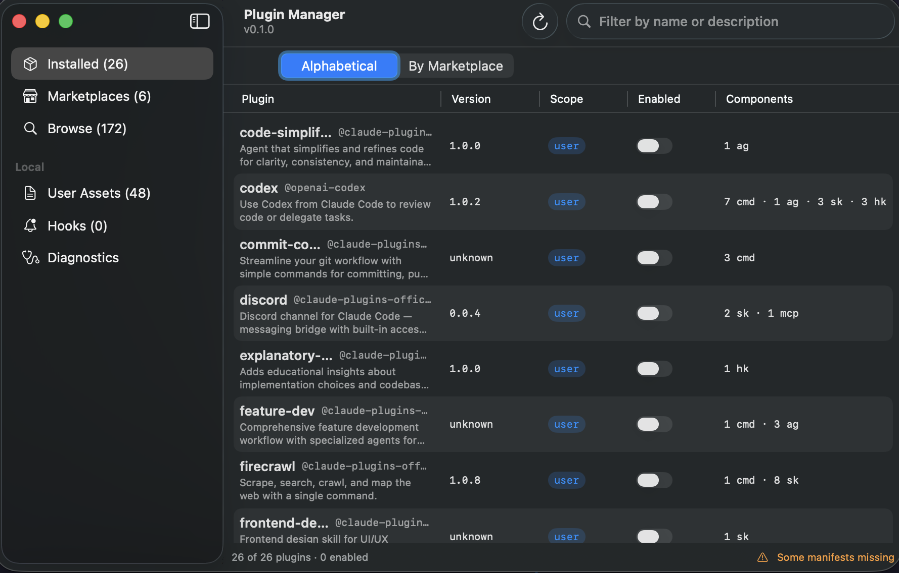

# Claude Code Plugin Manager

> 🇰🇷 한국어: [README.ko.md](README.ko.md)

A native macOS menu bar app for managing the plugins, marketplaces, skills, and hooks under `~/.claude/` from a single window.



> Full specification: [PRD.md](PRD.md) (v2.2, ~2,000 lines).

## Highlights

- **Inventory** — Toggle the installed-plugin list between alphabetical and grouped-by-marketplace views (Installed tab).
- **Catalog search** — Auto-focused search field on the Browse tab; substring filter across name, marketplace, and description.
- **Marketplace lifecycle** — Add / Refresh / Remove / toggle Auto-Update (with cascade confirmation dialogs).
- **Plugin lifecycle** — Install (scope picker) / Uninstall (`--keep-data`) / Update / Enable·Disable.
- **Version visibility** — Plugin version column + per-marketplace `metadata.version` capsule + last-refresh timestamp.
- **Auto-refresh** — `~/.claude/` tree changes are picked up by FSEvents and trigger a debounced reload.
- **Safe mutations** — proper-lockfile-compatible FileLock + passthrough preservation + automatic backups.
- **Diagnostics & cleanup** — Disk integrity checks and Orphaned Cache cleanup in the Diagnostics tab.

## Quick start (development)

```bash
# PluginCore unit tests (97 tests)
cd Packages/PluginCore && swift test

# Build the app
cd Packages/App && swift build

# Run the menu bar app (dev mode — no Dock icon, ⌘Q to quit)
cd Packages/App && swift run CCPluginManager
```

Requirements: macOS 13+, Swift 6.0 toolchain, `claude` CLI 2.1+.

## Local install (/Applications + launch at login)

The dev path for installing a release build on your own machine — not the
distribution dmg flow. No Apple Developer certificate required (uses ad-hoc
codesign).

```bash
# Build → install to /Applications/CCPluginManager.app → register login item
Scripts/install-local.sh

# Install only, skip the login-item registration
Scripts/install-local.sh --no-login

# Uninstall (removes both the login item and /Applications/CCPluginManager.app)
Scripts/install-local.sh --uninstall
```

What the script does:
1. `swift build -c release` (Packages/App)
2. Assembles a `.app` bundle — `Info.plist` sets `LSUIElement=YES` (no Dock icon, menu bar only)
3. Ad-hoc codesigns with `codesign --sign -` (not for distribution)
4. Strips `com.apple.quarantine` so Gatekeeper's "unidentified developer" dialog doesn't appear on first launch
5. Adds a hidden login item via `osascript` against System Events

On first launch macOS prompts once for File System / Apple Events permission — approve it and the app appears in the menu bar on every subsequent boot.

## Directory layout

```
ccplugin/
├── PRD.md                   # Specification (v2.2)
├── README.md                # This file (English, primary)
├── README.ko.md             # Korean translation
├── Packages/
│   ├── PluginCore/         # Foundation-only, non-UI library
│   │   ├── Sources/
│   │   │   ├── Schemas/    # Swift Codable mirrors of the zod schemas
│   │   │   ├── Readers/    # Disk JSON parsers (actor-isolated)
│   │   │   ├── Writers/    # Passthrough-preserving mutations
│   │   │   ├── Bridge/     # claude CLI delegation (ProcessRunner)
│   │   │   ├── Locking/    # proper-lockfile compatible + backup
│   │   │   ├── Diagnostics/# Lightweight disk checks + cache cleanup
│   │   │   ├── Watching/   # FSEvents
│   │   │   ├── Paths/      # ~/.claude path resolution
│   │   │   └── IDs/        # Regex + impersonation guards
│   │   └── Tests/          # swift-testing (97 tests)
│   └── App/                 # SwiftUI MenuBarExtra
│       └── Sources/App/
│           ├── AppMain.swift      # @main + AppDelegate
│           ├── UI/                # SwiftUI views
│           └── ViewModels/        # 4-source synthesis + actions
├── Scripts/                 # Distribution pipeline
│   ├── install-local.sh     # Local /Applications install + login item
│   ├── sparkle-keygen.sh    # Sparkle EdDSA key
│   ├── sign.sh              # Developer ID + Hardened Runtime
│   ├── build-dmg.sh         # UDZO dmg
│   ├── notarize.sh          # notarytool + stapler
│   ├── release.sh           # Orchestrator
│   └── entitlements.plist
├── spike/                   # M0 spike output + fixtures
└── .github/workflows/       # CI
```

## Architecture

Built on the **3-Layer model** from PRD §1.2:

| Layer | Location | Manager's role |
|---|---|---|
| 1 (intent) | `~/.claude/settings.json` | Mutable |
| 2 (materialization) | `~/.claude/plugins/` | Mutable (CLI-delegated where possible) |
| 3 (active) | The Claude session's in-process AppState | Read-only — surface a "reload-plugins" hint |

The manager only touches Layers 1 and 2. It cannot trigger an automatic
reload-plugins, so a banner instructs the user instead.

## Main window tabs

`NavigationSplitView` with sidebar + detail. Every tab auto-refreshes via
FSEvents; a Refresh button in the top-right does a manual reload.

### Installed
The installed-plugin inventory. Composed from four sources:
`installed_plugins.json` (V2) + `settings.json` + each plugin's `plugin.json` +
a directory scan.

- **Two views (persisted via `@AppStorage`)**
  - **Alphabetical** (default): a `Table` sorted by plugin id — Plugin / Version / Scope / Enabled / Components columns.
  - **By Marketplace**: a `List` + `Section` per marketplace, header reads `🛍 marketplace · N plugins`. Plugins with no marketplace land under `(no marketplace)` at the end.
- Top search bar filters by name or description (case-insensitive substring).
- Toggle to enable/disable (user scope only — direct `settings.json` flip for a snappy UX, per PRD §6.1). Other scopes get a hover hint.
- Context menu: Enable/Disable · Update · Uninstall (confirmation dialog with `--keep-data` option).

### Marketplaces
Composes `known_marketplaces.json` + each marketplace's `marketplace.json` +
the user-intent autoUpdate flag from `settings.json`.

- Columns: Marketplace (name · v-version capsule · source · "Updated 2 hours ago") / **Version** (`metadata.version`, or `—` if absent) / Plugins / Auto-Update / actions.
- Action bar: **Add Marketplace** (sheet — source/scope/sparse paths) · **Refresh All** (delegates to `claude plugin marketplace update`).
- Row actions: Refresh / Auto-Update toggle (optimistic UI) / Remove (cascade confirmation dialog).
- Seed marketplaces and entries not declared in user settings show a lock icon and stay read-only.

### Browse
Cross-join of every marketplace catalog plus an installed flag.

- Top **always-visible search bar**: `TextField` + magnifier + clear-X. Auto-focuses on tab entry (`@FocusState`) so you can filter immediately from the keyboard.
- Two views (same pattern as Installed, persisted via `@AppStorage`):
  - **Alphabetical**: not-installed first, then by id.
  - **By Marketplace**: a `Section` per marketplace; header reads `🛍 marketplace · v-version · N plugins · X installed` (the green "X installed" suffix only appears when the count is > 0).
- Filter substring matches against name, marketplace, and description.
- Install button → scope picker sheet → CLI bridge.

### User Assets / Hooks / Diagnostics
- **User Assets**: direct scan of `~/.claude/{commands,agents,skills}`.
- **Hooks**: the `settings.json` hooks tree + Add/Remove sheet.
- **Diagnostics**: disk integrity checks + Orphaned Cache cleanup (handles Q2 spike leftovers).

## Milestone status

- ✅ M0 (spike + infrastructure) — Q2/Q8 spike complete, 97 unit tests
- ✅ M1 (read-only inventory) — Installed/Marketplaces/Browse tabs, FSEvents auto-refresh
- ✅ M2 (marketplace mutations) — Add/Refresh/Remove/toggle Auto-Update, FileLock, BackupService
- ✅ M3 (plugin lifecycle) — install/uninstall/enable/disable/update + ReloadHint banner
- ✅ M4 (user assets + diagnostics) — UserAssets/Hooks/Diagnostics tabs, OrphanedCache cleanup
- ✅ UX iteration — by-marketplace grouping, always-visible search, plugin/marketplace version display
- ⏸ Distribution — Apple Developer certificate, Sparkle integration, Homebrew Cask (manual)

## Data model notes

`MarketplaceCatalog.metadata.version` is only declared by some marketplaces
(e.g. `openai-codex` v1.0.4). The UI receives it as `MarketplaceRow.version`
(`Optional`) and shows `—` when nil — surfacing the marketplace schema's
micro-drift instead of forcibly normalizing it.

`description` is also legal in two places — at the root or under `metadata` —
so an `effectiveDescription` helper falls back from root to `metadata`.

## Related documents

- [PRD.md](PRD.md) — Full specification (the source of truth for every implementation decision).
- [spike/REPORT.md](spike/REPORT.md) — M0 spike report (CLI surface validation, lockfile policy, Q2/Q8 RESOLVED).
